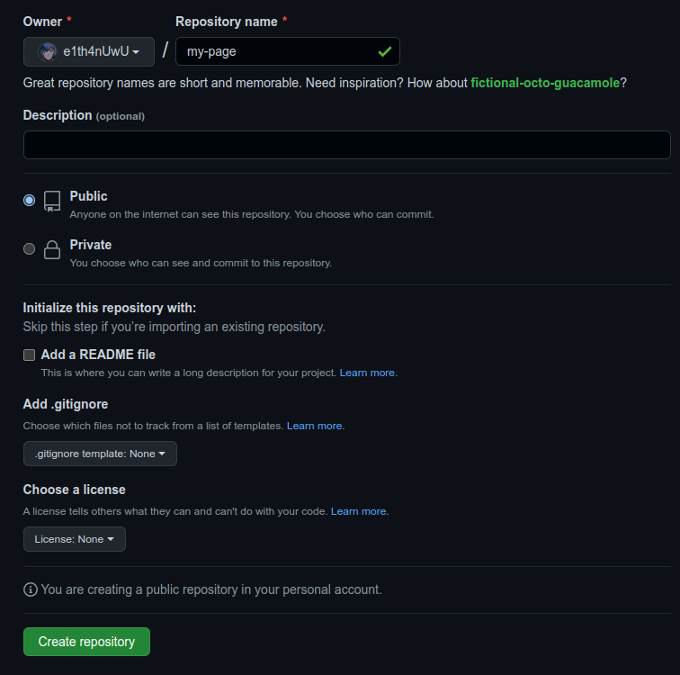
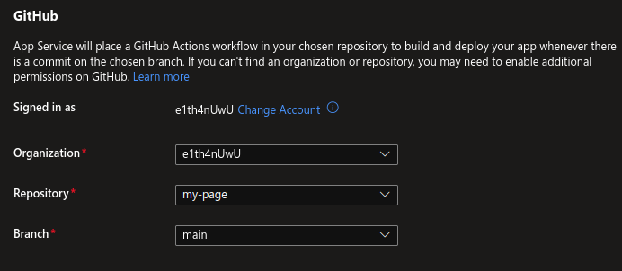

# Creating an App Service using Microsoft Azure Portal and GitHub

---------------------------------------------------------

## Requirements
- Microsoft Azure Account ( with funds or credits    )
- Microsoft Azure Suscription
- GitHub Account
- A web browser
- Basic experience with the command line
- Git installed on your system

---------------------------------------------------------

## Instructions
#### 1. Login to the [Azure Portal](https://portal.azure.com/).
#### 2. Once your on the portal's home page, you will see something like this:

#### 3. Inside the search bar (located at the top), look for *App Services* and click on it.

#### 4. Click on *Create*.

#### 5. You will now have to configure the project details: select your suscription and resource group, in my case, I am creating a new resource group.

#### 6. Now, configure the instance details. I will be providing you with PHP code, so please set the runtime stack  as *PHP 8.0*.

#### 7. You can now configure the App Service Plan, however, I'll be using the free one because during this practice I won't be deploying a permanent page.

#### 8. If you don't want to configure anything else, click on *Review + Create*.

#### 9. If validation passed, click *Create*.

#### 10. Deployment will begin, please wait a couple of seconds until it's completed.

#### 11. Go to GitHub and download the folder *web-page* that's located inside this repository, you can clone the repository or just download it as a zip file and extract it.
#### 12. Go back to the [main GitHub page](https://github.com/)
#### 13. Create a new repository.

#### 14. Now, configure the details of your repository. You will only really need to configure it's name, the rest of the repository details are optional. When you're done, just click *Create repository*.

#### 15. Open your command line or terminal and navigate to wherever you downloaded the *web-page* folder.

#### 16. Copy the following commands into your terminal:
> git init
> git add .
> git commit -m "Initial commit"
#### 17. Now, go to your new GitHub repository and copy the commands inside the "*…or push an existing repository from the command line*" section and execute them in your terminal

#### 18. If you did everything correctly, when you reload your GitHub repository page, you'll see all o the folder's files.

#### 19. Go back to the Azure Portal and go to your new App Service's dashboard by clicking *Go to Resource*.

#### 20. Inside the dashboard, click on *Deployment center*.

#### 21. Select *GitHub* from the dropdown container.

#### 22. If needed, login to your GitHub account.
#### 23. Now, configure the GitHub details.

#### 24. Click on *Save* and wait for deployment to be completed.

#### 25. Go to your GitHub repository and reload the page.
#### 26. Click on *Actions*.

#### 27. You will see the status of your GitHub deployment, if you were quick enough you may see that it is still in progress, please wait until it completes and looks something like this:

#### 28. Click on the text at the right side of the checkmark (*Add or update the Azure...*).
#### 29. Once you're inside, click on your website's URL.

#### 30. You are now on your deployed page! Congratulations!

---------------------------------------------------------

## Congratulations ! You've just made deployed your first App Service using the Azure Portal and GitHub !